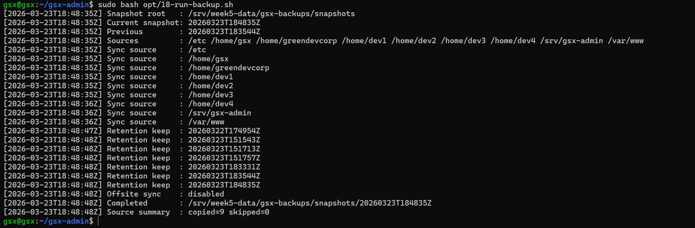
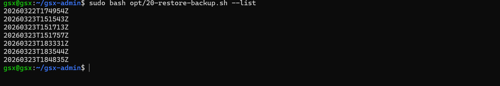
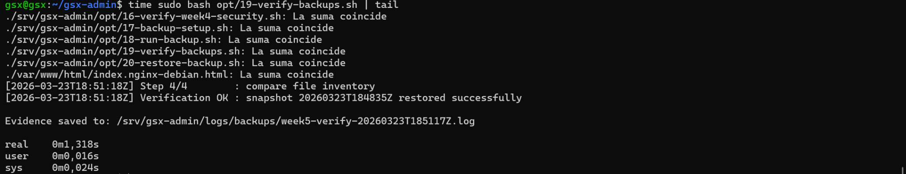
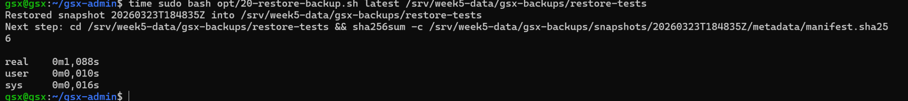
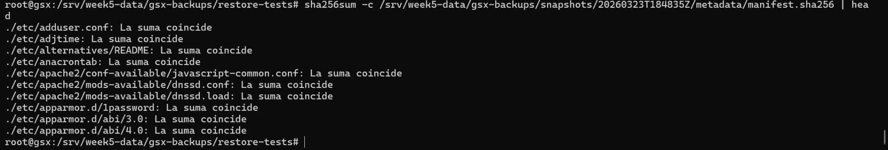

# Recovery Test Evidence

This document records a **real backup recovery verification** executed on the project VM before final handoff. It captures the snapshot tested, the commands used, the measured recovery timings, and visual evidence from the terminal session.

---

## 1. Test metadata

- **Operator:** Admin1
- **Date and time:** 2026-03-23 19:05 CET
- **Host / VM:** Debian GSX VM (`gsx` shell hostname)
- **Snapshot ID tested:** `20260323T184835Z`
- **Primary restore target used by verification:** `/srv/week5-data/gsx-backups/restore-tests/20260323T184835Z-20260323T195117Z`
- **Manual restore target used for separate timing check:** `/srv/week5-data/gsx-backups/restore-tests`
- **Reason for test:** final handoff evidence and restore validation
- **Evidence log:** `/srv/gsx-admin/logs/backups/week5-verify-20260323T185117Z.log`

---

## 2. Commands executed

```bash
sudo bash opt/18-run-backup.sh
sudo bash opt/20-restore-backup.sh --list
time sudo bash opt/19-verify-backups.sh | tail
time sudo bash opt/20-restore-backup.sh latest /srv/week5-data/gsx-backups/restore-tests

# manual manifest verification as root
cd /srv/week5-data/gsx-backups/restore-tests/
sha256sum -c /srv/week5-data/gsx-backups/snapshots/20260323T184835Z/metadata/manifest.sha256 | head
```

---

## 3. Result summary

| Check | Result | Evidence |
|---|---|---|
| Fresh snapshot creation | PASS | `opt/18-run-backup.sh` completed and created snapshot `20260323T184835Z` |
| Snapshot discoverability | PASS | `opt/20-restore-backup.sh --list` showed `20260323T184835Z` in the available snapshot list |
| Automated verification flow | PASS | `opt/19-verify-backups.sh` reported `Verification OK` and saved an evidence log |
| Manual restore to alternate path | PASS | `opt/20-restore-backup.sh latest /srv/week5-data/gsx-backups/restore-tests` completed successfully |
| Manifest validation after restore | PASS | `sha256sum -c .../manifest.sha256` returned matching checks for restored files |
| File inventory match | PASS | verification script reported `compare file inventory` and `restored successfully` |
| Overall result | **PASS** | Manifest passed, restore completed, file inventory matched, and no anomalies were observed |

---

## 4. Timings

Measured from the shell `time` output shown in the screenshots:

- **Automated verify run:** `real 0m1,318s` → **1.318 seconds**
- **Manual restore run:** `real 0m1,088s` → **1.088 seconds**

These timings are short because the restore was performed to an alternate path on the same prepared test VM and used the latest locally available snapshot.

---

## 5. Notes and observations

- The backup script reported **Completed** for snapshot `20260323T184835Z`.
- The restore list showed the new snapshot among the available restore points.
- The verification script reached **Step 4/4** and reported:
  - `compare file inventory`
  - `Verification OK`
  - `snapshot 20260323T184835Z restored successfully`
- The verification script wrote a persistent evidence log at:
  - `/srv/gsx-admin/logs/backups/week5-verify-20260323T185117Z.log`
- The manual restore command restored the snapshot to an **alternate path**, not over production paths.
- The post-restore `sha256sum -c` check showed restored files matching the stored manifest.
- **Anomalies:** none observed during this test.

---

## 6. Evidence screenshots

### 6.1 Fresh snapshot creation

The backup job created snapshot `20260323T184835Z` under `/srv/week5-data/gsx-backups/snapshots`.



### 6.2 Available restore points

The snapshot list confirms that `20260323T184835Z` is present and can be selected for restore.



### 6.3 Automated verification and evidence log

The verification run completed successfully, reported `Verification OK`, and saved a timestamped log file.



### 6.4 Manual restore to alternate path

A separate manual restore was executed to `/srv/week5-data/gsx-backups/restore-tests` to measure direct restore timing outside the full verification flow.



### 6.5 Post-restore manifest validation

The restored files were checked against the snapshot manifest with `sha256sum -c`, and the sampled output shows matching checks.



---

## 7. Conclusion

A recent restore test was performed successfully against snapshot `20260323T184835Z`. The test demonstrates that:

- the backup set can be enumerated and selected,
- the latest snapshot can be restored to an alternate location,
- the restore output matches the stored manifest,
- the verification workflow generates a reviewable evidence log, and
- recovery for this test case completed successfully within approximately **1.3 seconds** for the verification flow and **1.1 seconds** for the direct restore command.


---

## 8. Template for future entries

Future recovery tests can be appended using this minimal format:

```text
Operator: <name>
Date: <timestamp>
Host: <hostname>
Snapshot: <snapshot-id>
Restore target: <path>
Result: PASS/FAIL
Evidence log: <path>
Timing: <elapsed time>
Notes: <summary>
```
